# Countryballs

 **Countryballs** are characters in [Luces Siegas](lsgamepage.md) that are the primary characters and the
only playable characters in the game. Countryballs are either controlled by the [player's](player.md) country or the game's AI.

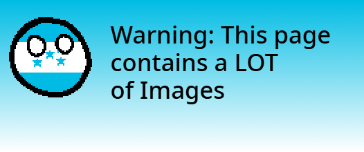

## Jump To
 [Behavior and Mechanics](#behavior-and-mechanics)  
 [List of Countryballs and IDs](#list-of-countryballs-and-idsinternal-names)

## Behavior and Mechanics
A random quantity of 0-5 other countryballs spawns alongside the player during World Generation.   
There is a `50%` chance for one of these countryballs to be a blank white "Blankball" (id: `127`) which can be added to the Player's country.

### Stats
A countryball has four primary stats: `H` (Health), `F` (Strength), `E` (Endurance) and `V` (Speed)
These stats can be any integer between `0` and `17` with `0` being the worst and `17` being the best.
Maximum HP (Hit Points) are calculated using this formula, where the minimum HP is `60` and the maximum is `264`:
maximumHP = (h*12) + 60

When breeding, stats are mixed between the two parents and merged down. The formula for breeding is listed below, where a is the first parent's stat and b is the second parent's stat:
(a+b) / 2 

### Flag
All Countryballs have an internal `pais` variable that controls their flag type
To see a list of all possible appearances see [List of Countryballs and IDs/Internal Names](#list-of-countryballs-and-idsinternal-names)

### Breeding
You can breed   Countryballs of the opposite gender together
(countryball type does NOT matter) by going near the other Countryball and pressing `B` on your keyboard

#### In Asylum Mode
In [Asylum Mode](lsasylum.md), all Countryballs that did not spawn as a part of your country or as Blankballs are hostile towards the Player.  
Breeding is disabled in Asylum Mode and therefore, more countryballs for your country are impossible to obtain unless you can find Blankballs.

#### In Imperial Mode*
In [Imperial Mode](lsimperialmode.md), Breeding works like in regular gameplay, however you cannot breed with the Bosses or the Empires themselves due to them not being considered 
regular countryballs.

## List of Countryballs and IDs/Internal Names
There are a total of 189 Countryballs in the game and 191 total IDs (189 Countryballs and 2 special IDs)
|Name|Image|ID|Internal Name|
|----|----|----|----|
|El Salvador||`1`|elsalvador|
|Guatemala||`2`|guatemala|
|Mexico||`3`|mexico|
|Belize||`4`|belice|
|United States||`5`|america|
|Honduras||`6`|honduras|
|Nicaragua||`7`|nicaragua|
|Canada||`8`|canada|
|Costa Rica||`9`|costarica|
|Panama||`10`|panama|
|Colombia||`11`|colombia|
|Chile||`12`|chile|
|Venezuela||`13`|venezuela|
|Ecuador||`14`|ecuador|
|Peru|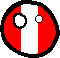|`15`|peru|
|Bolivia|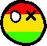|`16`|bolivia
|Paraguay|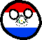|`17`|bolivia
|Argentina||`18`|argentina|
|Suriname|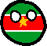|`19`|suriname|
|Guyana||`20`|guyana|
|Uruguay|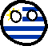|`21`|uruguay|
|Brazil|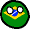|`22`|brasil|
|Cuba|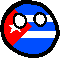|`23`|cuba|
|Haiti|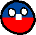|`24`|haiti|
|Dominican Republic|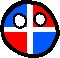|`25`|republicadominicana|
|Bahamas||`26`|bahamas|
|Trinidad and Tobago||`27`|trinidad|
|Spain|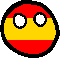|`28`|españa|
|Portugal||`29`|portugal|
|France|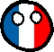|`30`|france|
|Netherlands|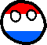|`31`|paisesbajos|
|Luxembourg|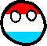|`32`|luxembourg|
|Belgium|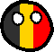|`33`|belgia|
|Italy||`34`|italia|
|Switzerland||`35`|suiza|
|Austria|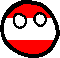|`36`|austria|
|Germany|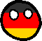|`37`|alemania|
|Poland||`38`|polonia|
|Hungary|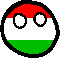|`39`|hungria|
|Czechia|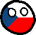|`40`|czech|
|Slovakia|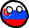|`41`|slovakia|
|Slovenia|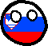|`42`|slovenia|
|Croatia|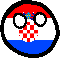|`43`|croatia|
|Bosnia||`44`|bosnia|
|Serbia|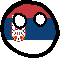|`45`|serbia|
|Montenegro|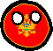|`46`|montenegro|
|Albania|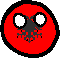|`47`|albania|
|Greece||`48`|greece|
|Macedonia|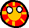|`49`|macedonia|
|Türkiye (Turkey)||`50`|turkiye|
|Bulgaria|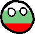|`51`|bulgaria|
|Romania|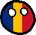|`52`|romania|
|Moldova|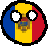|`53`|moldova|
|Ukraine|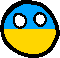|`54`|ukraine|
|Belarus|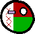|`55`|belarus|
|San Marino|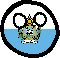|`56`|sanmarino|
|Russia|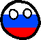|`57`|russia|
|Lithuania|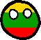|`58`|lithuania|
|Latvia||`59`|latvia|
|Estonia||`60`|estonia|
|Denmark|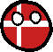|`61`|denmark|
|Sweden|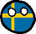|`62`|sweden|
|Iceland|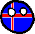|`63`|iceland|
|Finland||`64`|finland|
|Norway|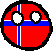|`65`|norway|
|Ireland||`66`|ireland|
|United Kingdom (Britain)|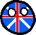|`67`|britain|
|Vatican City|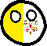|`68`|vatican|
|Georgia|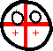|`69`|georgia|
|Armenia|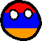|`70`|armenia|
|Azerbaijan|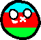|`71`|azerbaijan|
|Kazakhstan|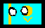|`72`|kazakhstan|
|Kyrgyzstan|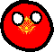|`73`|kyrgyzstan|
|Uzbekistan|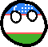|`74`|uzbekistan|
|Tajikistan|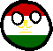|`75`|tajikistan|
|Saudi Arabia||`76`|arabiasaudita|
|Afghanistan|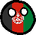|`77`|afganistan|
|Iran|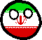|`78`|iran|
|Pakistan||`79`|pakistan|
|India|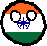|`80`|india|
|1ball||`81`|1ball|
|2ball||`82`|2ball|
|3ball||`83`|3ball|
|4ball||`84`|4ball|
|5ball||`85`|5ball|
|6ball||`86`|6ball|
|7ball||`87`|7ball|
|8ball||`88`|8ball|
|Iraq||`89`|irak|
|Yemen||`90`|yemen|
|United Arab Emirates||`91`|eau|
|Oman||`92`|oman|
|Palestine||`93`|palestina|
|Lebanon||`94`|libano|
|Syria||`95`|siria|
|Jordan||`96`|jordania|
|Kuwait||`97`|kuwait|
|Bahrain||`98`|barein|
|Qatar||`99`|catar|
|Nepal||`100`|nepal|
|Bhutan||`101`|butan|
|Bangladesh||`102`|banglades|
|China||`103`|china|
|North Korea||`104`|coreadelnorte|
|South Korea||`105`|coreadelsur|
|Japan||`106`|japon|
|Mongolia||`107`|mongolia|
|Myanmar||`108`|myanmar|
|Laos||`109`|laos|
|Cambodia||`110`|camboya|
|Vietnam||`111`|vietnam|
|Malaysia||`112`|malaysia|
|Thailand||`113`|tailandia|
|Indonesia||`114`|indonesia|
|Philippines||`115`|filipinas|
|Israel||`116`|israel|
|Australia||`117`|australia|
|New Zealand||`118`|nuevazelanda|
|Egypt||`119`|egipto|
|Sudan||`120`|sudan|
|South Sudan||`121`|sudandelsur|
|Libya||`122`|libia|
|Algeria||`123`|argelia|
|Morocco||`124`|marruecos|
|Mauritania||`125`|mauritania|
|Tunisia||`126`|tunez|
|Blankball||`127`|enblanco|
|Somalia||`128`|somalia|
|Kenya||`129`|kenia|
|Ethiopia||`130`|etiopia|
|Eritrea||`131`|eritrea|
|Djibouti||`132`|yibuti|
|Blankball||`133`|enblanco2|
|Niger||`134`|niger|
|Nigeria||`135`|nigeria|
|Chad||`136`|chad|
|Mali||`137`|mali|
|Senegal||`138`|senegal|
|Guinea||`139`|guinea|
|Cote d'Ivoire (Ivory Coast)||`140`|ivorycoast|
|Burkina Faso||`141`|burkinafaso|
|Sierra Leone||`142`|sierraleone|
|Liberia||`143`|liberia|
|Cameroon||`144`|cameroon|
|Ghana||`145`|ghana|
|Benin||`146`|benin|
|Togo||`147`|togo|
|Gabon||`148`|gabon|
|Madagascar||`149`|madagascar|
|Botswana||`150`|botsuana|
|Malawi||`151`|malaui|
|Republic of the Congo||`152`|congo|
|Democratic Republic of the Congo||`153`|congo2|
|Namibia||`154`|namibia|
|Testball||`155`|pruebas|
|Angola||`156`|angola|
|Tanzania||`157`|tanzania|
|Mozambique||`158`|mozambique|
|Gambia||`159`|gambia|
|Guinea-Bissau||`160`|guineabissau|
|Equatorial Guinea||`161`|guineaecuatorial|
|Lesotho||`162`|lesoto|
|South Africa||`163`|sudafrica|
|Eswatini||`164`|esuatini|
|Zambia||`165`|zambia|
|Uganda||`166`|uganda|
|Zimbabwe||`167`|zimbabue|
|Rwanda||`168`|ruanda|
|Burundi||`169`|burundi|
|Comoros||`170`|comoros|
|Seychelles||`171`|seychelles|
|Sao Tome and Principe||`172`|saotome|
|Central African Republic||`173`|republicacentroafricana|
|Mauritius||`174`|mauricio|
|Cape Verde||`175`|caboverde|
|Papua New Guinea||`176`|papuanuevaguinea|
|Palau||`177`|palau|
|Nauru||`178`|nauru|
|East Germany||`179`|alemaniadeleste|
|Soviet Union||`180`|unionsovietica|
|Civilian Ensign (El Salvador)||`181`|elsalvador2|
|Austrian Empire||`182`|austria2|
|Yugoslavia||`183`|yugoslavia|
|Federal Republic of Central America||`184`|republicafederaldecentroamerica|
|Reichtangle||`185`|reichtanglo|
|El Salvador (Old Flag)||`186`|elsalvador3|
|Cabañas||`187`|cabanas|
|Scotland||`188`|esocia|
|Antarctica||`189`|antartida|   

## Special IDs
|Name|Image|ID|Internal Name|
|----|----|----|----|
|Boat||`190`|barco|
|Iron Boat||`191`|barco2|  

