# Countryballs

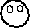 **Countryballs** are characters in [Luces Siegas](lsgamepage.md) that are the primary characters and the
only playable characters in the game. Countryballs are either controlled by the [player](player.md)'s country or the game's AI.

## List of Countryballs and IDs / Internal Names
There are a total of 189 Countryballs in the game and 191 total IDs (189 Countryballs and 2 special IDs)
|Name|Image|ID|Internal Name|
|----|----|----|----|
|El Salvador|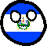|`1`|elsalvador|
|Guatemala|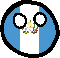|`2`|guatemala|
|Mexico|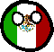|`3`|mexico|
|Belize|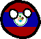|`4`|belice|
|United States|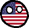|`5`|america|
|Honduras|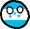|`6`|honduras|
|Nicaragua|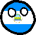|`7`|nicaragua|
|Canada|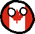|`8`|canada|
|Costa Rica|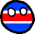|`9`|costarica|
|Panama|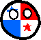|`10`|panama|
|Colombia|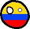|`11`|colombia|
|Chile|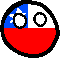|`12`|chile|
|Venezuela|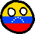|`13`|venezuela|
|Ecuador|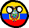|`14`|ecuador|
